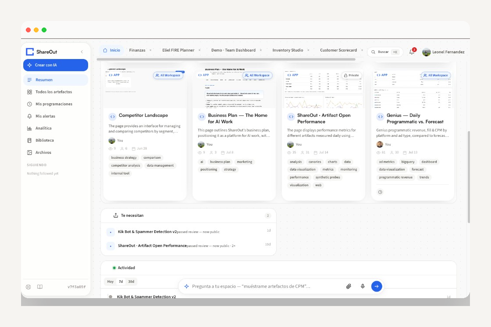
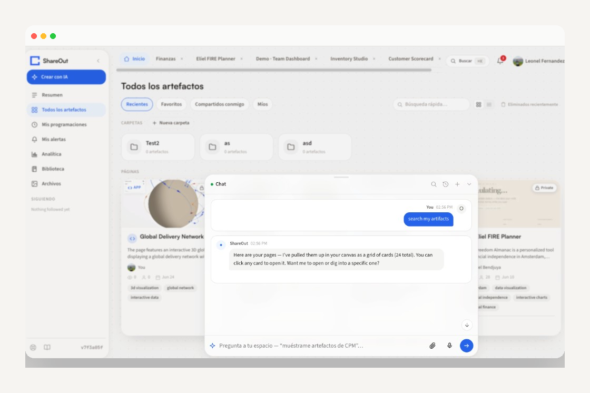
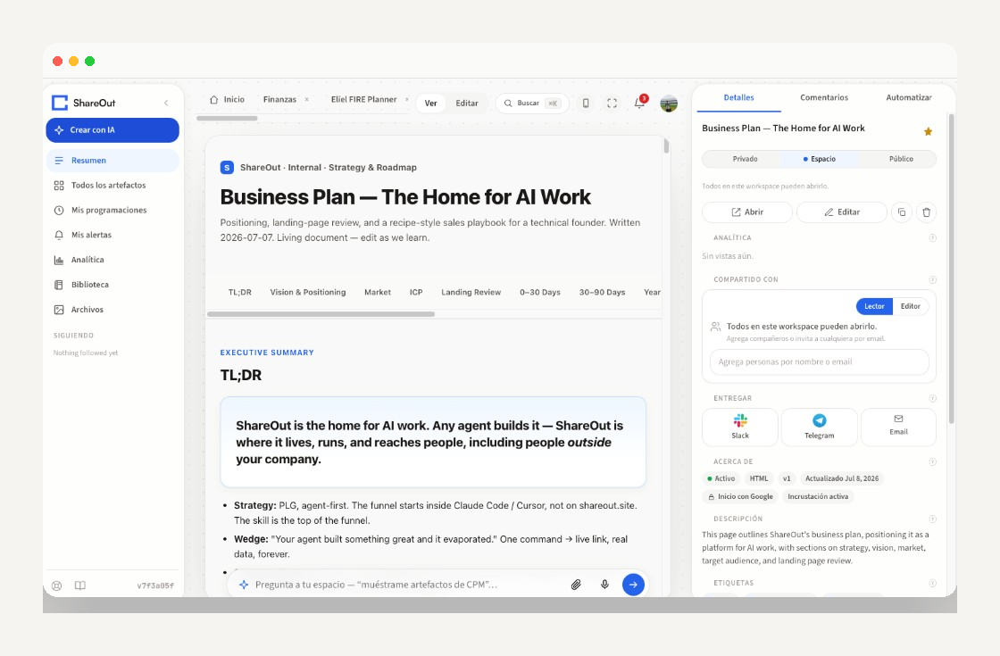
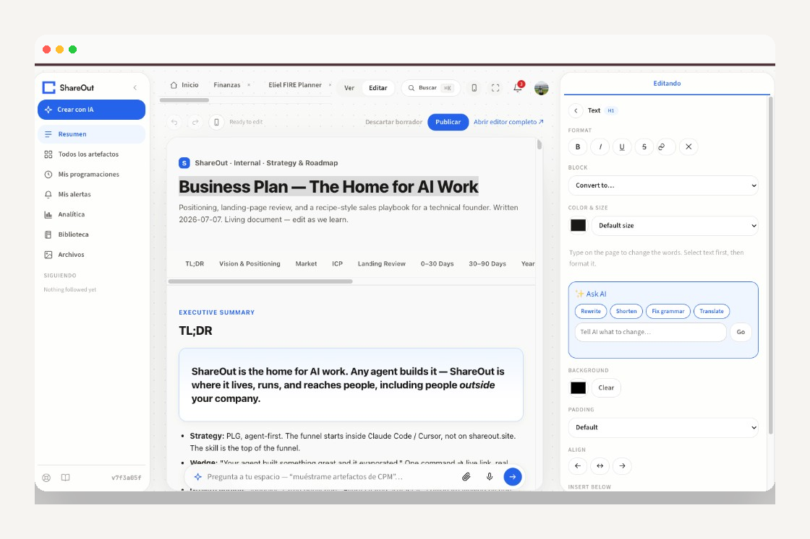

<p align="center">
  
</p>

<p align="center"><strong>Ideas deserve to exist.</strong></p>

<p align="center">
  Self-hosted workspace where agents publish live pages<br>
  (dashboards, decks, docs, forms) on <em>your</em> Cloudflare account.
</p>

<p align="center">
  <a href="https://deploy.workers.cloudflare.com/?url=https://github.com/getshareout/shareout/tree/main/shareout-app"></a>
</p>

<p align="center">
  <a href="LICENSE"></a>
  <a href="https://github.com/getshareout/shareout/actions/workflows/ci.yml"></a>
  <a href="https://github.com/getshareout/shareout/releases/tag/v0.1.0-pre"></a>
  
  
</p>

<p align="center">
  <a href="https://docs.shareout.site">Docs</a> ·
  <a href="https://docs.shareout.site/self-host/overview/">Install</a> ·
  <a href="CONTRIBUTING.md">Contributing</a> ·
  <a href="Design/README.md">Design system</a> ·
  <a href="SECURITY.md">Security</a>
</p>

---

## What it is

ShareOut is **self-hosted only** — you install it on **your** Cloudflare account.
There is no ShareOut cloud, seats, or checkout.

Agents (Claude, ChatGPT, Gemini, OpenClaw, yours) build the pages. Humans edit
together, comment, and approve what leaves the team. Data stays live from your
Sheets, warehouse, and APIs. ShareOut is not the builder — **agents build**;
ShareOut is where that work lives and gets shared as one link.

<p align="center">
  
</p>

---

## Deploy

**Goal: live in about five minutes.** Prefer the CLI — the Deploy button still
needs the same `npm run deploy` finish line.

**Prerequisites:** Node.js **24+**, a Cloudflare account, and Cloudflare’s
**[Workers Paid](https://developers.cloudflare.com/workers/platform/pricing/)**
plan (Durable Objects). ShareOut itself has no plans or fees.

**No Cloudflare account yet?** Sign up at
https://dash.cloudflare.com/sign-up/workers-and-pages, enable **Workers Paid**, then
`npx wrangler login`. An agent following
[`skills/ShareOutSkill/deploy/SKILL.md`](skills/ShareOutSkill/deploy/SKILL.md)
(Path 0) will walk you through that, then run deploy for you.

### A. One command (recommended)

```bash
git clone https://github.com/getshareout/shareout.git
cd shareout/shareout-app
npm ci
npx wrangler login          # once
npm run deploy              # provisions D1/R2/KV, SESSION_SECRET, BASE_URL, migrates, deploys
```

Open the workers.dev URL → `/setup` → create the first admin (email + password).

```bash
export SHAREOUT_ORIGIN=https://shareout.<your-subdomain>.workers.dev
export SHAREOUT_TOKEN=so_…   # Settings → API tokens
npm run smoke:hello
```

`curl $SHAREOUT_ORIGIN/health` → `"schema":"ready"` and no `warnings`.

### B. Deploy to Cloudflare button

1. Click **Deploy to Cloudflare** above.
2. Set **Root directory** = `shareout-app` (or repo root with deploy command below).
3. Set **Deploy command** = `npm run deploy` (not bare `npx wrangler deploy`).
4. Finish OAuth / Workers Paid if prompted.
5. Open the URL → `/setup` → first admin.

`npm run deploy` runs `provision:cf` (creates D1/R2/KV from placeholders, sets
`SESSION_SECRET` + `SHAREOUT_BASE_URL`), applies D1 migrations, then deploys.

Guide: [Install / self-host](https://docs.shareout.site/self-host/overview/).
Agent protocol: [skills/ShareOutSkill/deploy/SKILL.md](skills/ShareOutSkill/deploy/SKILL.md).

---

## Day 1 (after health is green)

1. **AI (optional but needed for Create with AI / Crew / Ask)** — set
   `OPENAI_API_KEY` or a Vercel AI Gateway key as a Worker secret, then redeploy.
   Without it, install still works; in-product AI stays off. Check gaps:
   `curl -sS "$SHAREOUT_ORIGIN/v1/admin/instance" -H "Authorization: Bearer $SHAREOUT_TOKEN" | jq .gaps`
2. **Invite someone** — Home → Admin → members (or share an artifact by email).
3. **Point agents at this instance:**

   ```json
   // ~/.shareout/credentials
   { "token": "so_…", "origin": "https://shareout.<your-subdomain>.workers.dev" }
   ```

   Agents load skill from `GET $ORIGIN/v1/skill` (not a hosted ShareOut URL).

4. **Make a real page** — **Create with AI** in the product, or stay with the API
   ([docs quickstart](https://docs.shareout.site/start/quickstart/)).

---

## Local develop

```bash
cd shareout-app
cp .dev.vars.example .dev.vars   # SESSION_SECRET at minimum
npm ci && npm run db:migrate && npm run dev
# http://localhost:55162/auth/dev?email=you@company.com&redirect=/home
```

---

## See it

**Ask your space** — search, open, and dig into artifacts in one conversation.

<p align="center">
  
</p>

**Share & deliver** — private / workspace / public, invite by email, ship to Slack, Telegram, or email.

<p align="center">
  
</p>

**Edit in the browser — or Ask AI** — rewrite, shorten, fix grammar, translate; publish when ready.

<p align="center">
  
</p>

---

## An artifact is not a flat file

A published page is a **surface your team works on**, not an export you send. Every
artifact carries its own conversation, its own audience, and its own history.

| | |
|---|---|
| **Threads on the work** | Comments with replies, reactions, @mentions, and unread state — on artifacts *and* on the files behind them. |
| **Real multiplayer** | Y.js CRDTs over WebSocket in a Durable Object: two people edit the same sheet, no merge conflicts. |
| **Who actually opened it** | View counts, trends, and daily rollups — visitors hashed; no third-party analytics tag. |
| **Organized like a workspace** | Folders, tags, favorites, and following. |
| **Decks with a presenter** | Native slide decks: speaker view, analytics, versions, PDF/PNG export, PowerPoint *import*. |
| **Approved before it leaves** | Publish approvals; visibility private → workspace → public. |
| **Delivered, not just posted** | Slack, Telegram, or email — once or on a schedule. |
| **Re-run, not rebuilt** | Crews and triggers keep the same link current. |

> Decks are ShareOut's own module — no Google Slides integration; export is PDF/PNG.
> PowerPoint is import-only.

---

## Build your internal BI on it

Connect a source once with **your** credentials, publish it as a dataset, and let
every artifact and agent read from it.

| | |
|---|---|
| **Nine connectors** | BigQuery · Snowflake · Google Sheets · Google Analytics · Google Ads · Facebook Ads · Shopify · Slack · Tienda Nube. |
| **Any other API** | Secrets proxy holds the key server-side — never in the page. |
| **Datasets, not exports** | First-class objects artifacts and agents read by name. |
| **Catalog with lineage** | Browse, search, and trace where a number came from. |
| **Jobs that keep it true** | Crews, digests, metric watches. |
| **Compute where it belongs** | SDK: `json` → `table` → realtime, plus Pyodide, grid, dashboard primitives. |

---

## Workspace menu

UI is English/Spanish (browser locale). English labels:

| Menu | What it is |
|------|------------|
| **Overview** | Recent artifacts, reviews, activity |
| **All artifacts** | Folders, pages, filters |
| **Schedules** / **Alerts** / **Analytics** | Keep pages running; health and views |
| **Datasets** / **Catalog** / **Knowledge** | Governed inputs and reuse |
| **Crew AI** / **Library** / **Files** | Automation, building blocks, assets |
| **Connectors** / **Admin** / **Following** | Your credentials, members, follows |

Primary CTA: **Create with AI** (needs an AI key — see Day 1).

---

## What you get

| | |
|---|---|
| **Your cloud** | D1 / R2 / Durable Objects in *your* Cloudflare account |
| **Your roster** | Owner / admin / member on *your* instance |
| **Your data plane** | Your credentials; pages stay live from the source |
| **No ShareOut plans** | Every feature on — you only pay Cloudflare for the Workers account |
| **Yours to rebrand** | [Design system](Design/README.md) · [docs site](docs-site/README.md) |
| **Agent-native** | Skill + API into the workspace |
| **Apache-2.0** | Patent grant; Cloudflare-ecosystem friendly |

> Pre-release — verify Deploy on a fresh Cloudflare account before company-wide rollout.

---

## What's in the box

| Piece | Path |
|-------|------|
| Worker — API, auth, workspaces | `shareout-app/` |
| Browser SDK | `shareout-app/sdk/` |
| Visual editor | `shareout-app/editor-client/` |
| Agent skill (**canonical**) | [`skills/ShareOutSkill/`](skills/ShareOutSkill/) — see [skills/README.md](skills/README.md) |
| Skill public mirror | [`getshareout/shareout-skill`](https://github.com/getshareout/shareout-skill) (do not edit as primary) |
| Design system | `Design/` |
| Docs site | `docs-site/` → [docs.shareout.site](https://docs.shareout.site) |

```
Control plane  →  Worker REST + auth + workspaces
Storage        →  D1 · R2 · Durable Objects (tables / realtime)
Execution      →  Sandboxed HTML + SDK (json → table → realtime)
```

**Agents**

| Goal | Start here |
|------|------------|
| Deploy this repo on Cloudflare | [skills/ShareOutSkill/deploy/SKILL.md](skills/ShareOutSkill/deploy/SKILL.md) |
| Publish into a running instance | [skills/ShareOutSkill/SKILL.md](skills/ShareOutSkill/SKILL.md) (`$ORIGIN` + token) |
| Where the skill is allowed to live | [skills/README.md](skills/README.md) |
| Contributing to the product | [AGENTS.md](AGENTS.md) |

Live skill zip after deploy: `GET {your-origin}/v1/skill`.

---

## Make it yours

| Want to change… | Start at |
|-----------------|----------|
| Colors, type, logo, tone | [Design/README.md](Design/README.md) — tokens in `shareout-app/packages/design-tokens/` |
| The documentation | [docs-site/README.md](docs-site/README.md) — or browse [docs.shareout.site](https://docs.shareout.site) |
| A landing page in front of the app | None ships here. Point `MARKETING_ORIGIN` at your own site, or leave unset (`/` → login) |
| What agents are told about your instance | [skills/ShareOutSkill/](skills/ShareOutSkill/) ([source of truth](skills/README.md)) |

---

## Community

[Issues](https://github.com/getshareout/shareout/issues) · [CONTRIBUTING.md](CONTRIBUTING.md) · [SUPPORT.md](SUPPORT.md) · [SECURITY.md](SECURITY.md) · [ROADMAP.md](ROADMAP.md) · [RELEASING.md](RELEASING.md) · [MAINTAINING.md](MAINTAINING.md) · [getshareout](https://github.com/getshareout)

**License:** [Apache-2.0](LICENSE) · [NOTICE](NOTICE)

*Ideas deserve to exist.*
