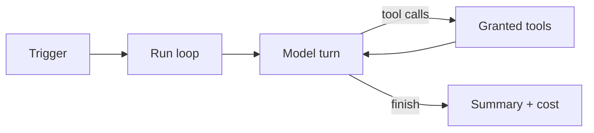

import { Steps, Aside } from '@astrojs/starlight/components';

Each artifact can run a **crew** — a server-side autonomous agent with tools to query
data, refresh snapshots, write JSON summaries, deliver to Slack, and more. Crews are
triggered on a schedule, by metric-alert follow-up (`on_trigger`), from the Telegram
bot (`ask_crew`), or manually via the crew API.

Feature key: **`ai.crew`** (labeled *CrewAI agents* in the admin catalog).

<Aside type="caution">
**Not the visitor chat widget.** [`sdk.agent`](/guides/ai-agent/) is a chat bubble inside
the published page for visitors. Crew runs **server-side** with **owner identity** and
owner-scoped tools. Visitors never see or configure it.
</Aside>

## When to use Crew

| You want… | Use |
| --- | --- |
| Answer visitor questions in the page | [AI chat agent](/guides/ai-agent/) (`sdk.agent`) |
| Run fixed SQL on a schedule (no LLM) | [Scheduled job](/guides/jobs/) → `query_snapshot` |
| Alert when a number crosses a threshold | [Metric alerts](/guides/metric-alerts/) |
| **Summarize, investigate, or deliver in natural language** | **Crew** |
| Ask a page's crew from Telegram | [Telegram bot](/guides/telegram-bot/) → `ask_crew` |
| Ask a page's crew from Slack | [Slack bot](/guides/slack-bot/) → `ask_crew` |

**Jobs** are deterministic — SQL and delivery config are fixed. **Crew** is agentic: it
decides which tools to call and how to phrase output. Use Crew when the task needs
judgment, narrative, or light follow-up queries.

## How a run works



1. A **trigger** or manual call starts a run.
2. The model receives your **instructions** plus optional run **input**.
3. Each **iteration**, the model may call [granted tools](/crew/tools/) (`json_get`,
   `connection_query`, `notify_send`, …).
4. The run ends with a **summary**, iteration count, and **cost** (micro-USD). Sensitive
   writes may queue an [owner approval](/crew/sdk-api/#write-approvals) first.

Stream live with `sdk.crew.run()` or replay from run history.

## What starts a run

| Source | How |
| --- | --- |
| **Cron trigger** | `sdk.crew.triggers.create({ kind: 'cron', cron: '…' })` |
| **Condition trigger** | Table row count crosses a predicate |
| **Event trigger** | e.g. `table.row.inserted` |
| **Metric alert** | `on_trigger.crew: true` on an alert rule |
| **Telegram** | Owner/editor confirms `ask_crew` via @ShareOutAI_bot |
| **Manual** | `sdk.crew.run({ input: '…' })` or REST `POST …/crew/run` |

## Prerequisites

1. **`ai.crew` enabled** — `GET /v1/features?artifact_id=…`. Off → `403 FEATURE_DISABLED`.
2. **Artifact owner** session or API token.
3. For delivery tools, destination flags (`dest.slack`, `dest.email`, …) must be on.

## Quick start

<Steps>

1. **Define** — instructions, model, tool grants (once per artifact).

   ```javascript
   const sdk = await ShareOut.create();

   await sdk.crew.define({
     name: 'Weekly reviewer',
     instructions: 'Read sales, flag revenue < 0, write a summary to json key "weekly_review".',
     model: 'claude-sonnet-4-20250514',
     tools: { read: ['table_query'], write: ['json_set'] },
   });
   ```

2. **Run** — test before scheduling.

   ```javascript
   for await (const event of sdk.crew.run({ input: 'Run now.' })) {
     if (event.type === 'finish') console.log(event.summary);
   }
   ```

3. **Schedule** (optional).

   ```javascript
   await sdk.crew.triggers.create({ kind: 'cron', cron: '0 9 * * 1' });
   ```

</Steps>

## Permissions and identity

- Crew tools run with **owner** identity for data writes and warehouse queries.
- Write tools may require owner approval when the artifact is public (`whenPublic`) or
  always (`notify_send` by default policy).
- Per-user connectors work for crew warehouse queries — same as the interactive data API.
- The HTML page **cannot widen** tool grants at runtime; only what you stored in
  `define()` is exposed to the model.

## Limits and billing

| Control | What it does |
| --- | --- |
| `maxIterations` | Cap tool loops per run |
| `runBudgetMicroUsd` | Optional per-run spend cap |
| Workspace AI balance | Runs halt when credits are exhausted |
| Concurrent runs | Capped server-side per artifact |

Check usage: `sdk.crew.usage(workspaceId)`.

## What's next

- [Tools reference](/crew/tools/) — every built-in tool in depth
- [Patterns & examples](/crew/patterns/) — refresh → narrate → deliver, daily briefings
- [SDK & API](/crew/sdk-api/) — `sdk.crew` methods and REST endpoints
