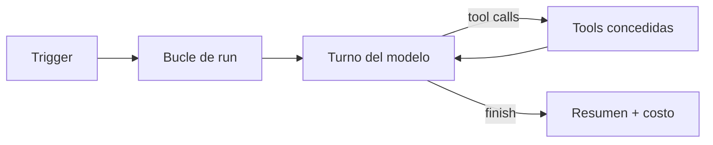

import { Steps, Aside } from '@astrojs/starlight/components';

Cada artifact puede ejecutar un **crew** — un agente autónomo del lado del servidor con
tools para consultar datos, refrescar snapshots, escribir resúmenes JSON, entregar a
Slack y más. Los crews se disparan por schedule, seguimiento de alerta (`on_trigger`),
desde Telegram (`ask_crew`), o manualmente vía la API.

Feature: **`ai.crew`** (etiqueta *CrewAI agents* en el catálogo admin).

<Aside type="caution">
**No es el chat para visitantes.** [`sdk.agent`](/es/guides/ai-agent/) es un globo de
chat en la página publicada. Crew corre **del lado del servidor** con **identidad del
owner** y tools con scope de owner.
</Aside>

## Cuándo usar Crew

| Querés… | Usá |
| --- | --- |
| Responder visitantes en la página | [Agente de chat IA](/es/guides/ai-agent/) |
| SQL fijo en schedule (sin LLM) | [Job programado](/es/guides/jobs/) → `query_snapshot` |
| Alerta por umbral | [Alertas de métricas](/es/guides/metric-alerts/) |
| **Resumir, investigar o entregar en lenguaje natural** | **Crew** |
| Pedir al crew desde Telegram | [Bot de Telegram](/es/guides/telegram-bot/) → `ask_crew` |
| Pedir al crew desde Slack | [Bot de Slack](/es/guides/slack-bot/) → `ask_crew` |

Los **jobs** son deterministas. **Crew** es agéntico: decide qué tools usar y cómo redactar.

## Cómo funciona un run



1. Un **trigger** o llamada manual inicia el run.
2. El modelo recibe **instrucciones** + **input** opcional.
3. Cada **iteración** puede llamar [tools concedidas](/es/crew/tools/).
4. Termina con resumen, iteraciones y costo (micro-USD).

## Qué inicia un run

| Fuente | Cómo |
| --- | --- |
| **Cron** | `triggers.create({ kind: 'cron', cron: '…' })` |
| **Condición** | Conteo de filas cruza un predicado |
| **Evento** | ej. `table.row.inserted` |
| **Alerta de métrica** | `on_trigger.crew: true` |
| **Telegram** | `ask_crew` vía @ShareOutAI_bot |
| **Manual** | `sdk.crew.run()` o `POST …/crew/run` |

## Requisitos

1. **`ai.crew` habilitado** — `GET /v1/features?artifact_id=…`
2. Sesión o token del **owner del artifact**
3. Flags de destino (`dest.slack`, etc.) para entregas

## Inicio rápido

<Steps>

1. **Definí** el crew.

   ```javascript
   await sdk.crew.define({
     instructions: 'Leé sales, marcá revenue < 0, escribí en json "weekly_review".',
     tools: { read: ['table_query'], write: ['json_set'] },
   });
   ```

2. **Ejecutá** una prueba.

   ```javascript
   for await (const event of sdk.crew.run({ input: 'Corré ahora.' })) {
     if (event.type === 'finish') console.log(event.summary);
   }
   ```

3. **Programá** (opcional).

   ```javascript
   await sdk.crew.triggers.create({ kind: 'cron', cron: '0 9 * * 1' });
   ```

</Steps>

## Permisos e identidad

- Tools corren con identidad de **owner**.
- Escrituras pueden requerir aprobación (`whenPublic`, `always`).
- Conectores per-user funcionan para queries de warehouse.
- El HTML **no puede ampliar** grants en runtime.

## Límites y facturación

| Control | Qué hace |
| --- | --- |
| `maxIterations` | Tope de loops por run |
| `runBudgetMicroUsd` | Tope de gasto por run |
| Balance AI del workspace | Detiene runs si se agota |

Uso: `sdk.crew.usage(workspaceId)`.

## Siguiente

- [Tools](/es/crew/tools/)
- [Patrones y ejemplos](/es/crew/patterns/)
- [SDK y API](/es/crew/sdk-api/)
