# ShareOut database schema

What every one of the **135 tables** is for, grouped the way
[`0000_init.sql`](0000_init.sql) groups them. Rules for *new* tables live in
[CONVENTIONS.md](CONVENTIONS.md); this document describes what exists today.

> `scripts/check-migrations.mjs` fails the build on a table that never reaches this
> file, so "documented" is a build-time guarantee rather than a good intention.

Runs on Cloudflare D1 (SQLite). Large objects — artifact bundles, datasets, uploads,
generated invoices — live in R2 and are referenced here by an `r2_key` column. The database
stores metadata and pointers, not bytes.

**Contents**

[The spine](#the-spine) · [Reading the diagrams](#reading-the-diagrams) ·
[01 Identity & auth](#01-identity--auth) · [02 Workspaces & access control](#02-workspaces--access-control) ·
[03 Artifacts](#03-artifacts) · [04 Data connections](#04-data-connections) ·
[05 Comments & editor](#05-comments--editor) · [06 Slides & presentations](#06-slides--presentations) ·
[07 Agents, crews & skills](#07-agents-crews--skills) · [08 Scheduled jobs](#08-scheduled-jobs) ·
[09 Analytics & audit](#09-analytics--audit) · [10 Metrics, alerts & watches](#10-metrics-alerts--watches) ·
[11 Email & messaging](#11-email--messaging) · [12 AI usage metering](#12-ai-usage-metering) ·
[13 Assets, blobs & knowledge](#13-assets-blobs--knowledge) ·
[14 Moderation, support & tests](#14-moderation-support--tests) ·
[Cross-cutting patterns](#cross-cutting-patterns) · [Known gaps](#known-gaps)

---

## The spine

Five tables carry almost everything else. If you only read one diagram, read this one.

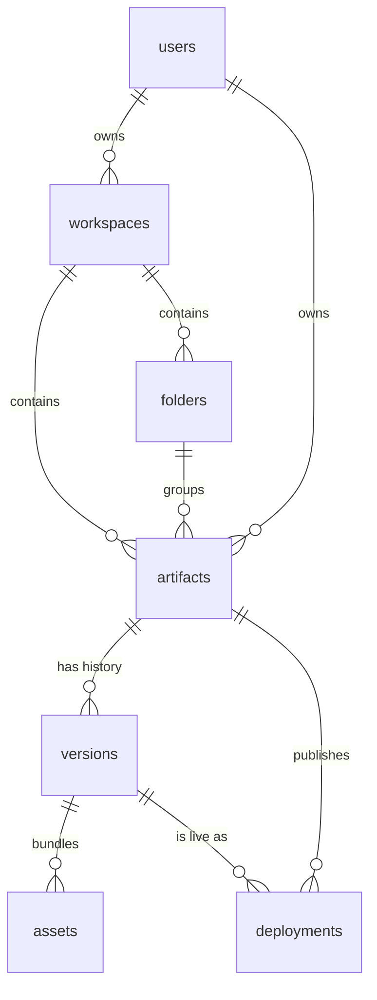

An **artifact** is the product's unit of work: a published interactive HTML page. Every
edit creates a **version**; a **deployment** points a channel at one version — `production`
is what visitors get, `candidate` is the staged next one. **Assets** are the files inside a
version's bundle.

**Artifacts are owned twice over, and this shapes many queries.** `artifacts.workspace_id`
is nullable: `NULL` means a personal artifact owned only via `owner_id`, non-`NULL` means it
belongs to a workspace and is governed by workspace membership. Most access-control code has
a personal branch and a workspace branch for exactly this reason. The string `'__personal'`
appears as a sentinel workspace key in a few places where a non-null value is required.

## Reading the diagrams

Diagrams show the relationships worth knowing, not every column, and not every table in the
domain — the table list under each diagram is the complete one.

`||--o{` is one-to-many and `||--o|` is one-to-optional-one.

**The lines show intent, not enforcement.** Most of these relationships have no foreign key
behind them — 44 of the 76 `artifact_id` columns are unconstrained. Do not read a line as a
guarantee that the database will cascade or reject. See [Known gaps](#known-gaps).

---

## 01 Identity & auth

Who someone is, and the credentials that prove it. ShareOut supports Google OAuth, email
OTP, and device-code flow for CLI/agent logins; email OTP always works, so a self-hosted
instance needs no OAuth setup.

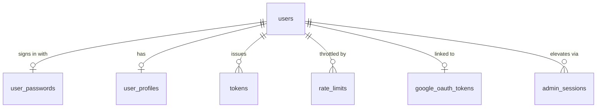

| Table | Holds |
|---|---|
| `users` | The account. `tier` drives quota lookups, `disabled` soft-bans, `is_service` marks non-human accounts, `identity_id` links merged identities, `last_janitor_at` tracks background cleanup. |
| `user_passwords` | PBKDF2 digest, `salt`, and the `iterations` used, stored per row so the cost can be raised later without invalidating existing credentials. Deliberately **not** columns on `users`, so no ordinary `SELECT` on `users` carries a password hash. It is the credential a fresh instance can issue with no EMAIL binding and no OAuth client. |
| `user_profiles` | Optional public profile: freeform `profile_md` and a `follows` list. |
| `tokens` | Every bearer token. `principal_type` is `user` (a personal `so_` token) or `workspace` (a `sot_` agent token); `user_id` is always the identity it authenticates as. Only `token_hash` is stored — the plaintext is shown once at creation. `scopes` is NULL for personal tokens, a csv for workspace ones, and `subject_external_user_id` lets a token act on behalf of an external user. Revocable via `revoked_at`. |
| `admin_sessions` | Short-lived elevated sessions for an artifact's admin surface, scoped to one `artifact_id` and expiring via `expires_at`. |
| `device_auth` | OAuth device-code flow for CLI and agent logins: `device_code`/`user_code` pair, `status` progressing to approved, then `claimed_at`. |
| `email_otp_codes` | One-time login codes. `code_hash` only, with `attempts` and `consumed_at` to stop replay and brute force. |
| `google_oauth_tokens` | Per-user Google tokens for Sheets access, encrypted (`access_token_encrypted` + `iv`). |
| `artifact_passwords` | Per-artifact username/password for password-gated artifacts. |
| `rate_limits` | Every rate limit in the product: one counter per (`principal_type`+`principal_id`, `action`, `window_start`). Principals are users and artifacts; the window string carries its own granularity (ISO day, ISO hour, `YYYY-MM-DD`, or `YYYY-MM-DDTHH:MM`). The ceilings live in code. Pruned nightly. |
| `onboarding_state` | Per-workspace first-run progress: skill acknowledged, dismissed, celebrated. |

## 02 Workspaces & access control

A workspace is the multi-tenant boundary. This is the densest domain in the schema because
ShareOut grants access five different ways, and they compose.

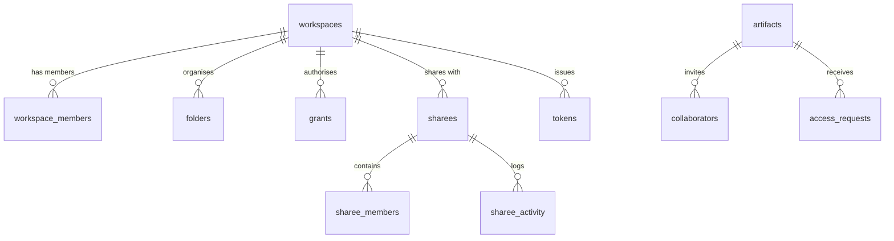

The five paths: **membership** (`workspace_members`), **per-artifact invite**
(`collaborators`, keyed by email so it works before signup), **capability grant**
(`grants`), **external org** (`sharees`), and **bearer token** (`tokens`, with
`principal_type = 'workspace'`).

| Table | Holds |
|---|---|
| `workspaces` | The tenant. Carries its own policy: `allowed_email_domains`/`allowed_emails` gate joining, `session_max_days` caps session life, `public_publish_policy` + `public_publish_approvals_required` govern publishing, `branding` and `feature_flags` are JSON. |
| `workspace_members` | Membership and `role` (`owner`/`admin`/`member`). `member_class` separates internal staff from external collaborators. |
| `workspace_invite_claims` | Pending invites. `code_hash` only; `expires_at` and `claimed_at` make each single-use. |
| `workspace_llm_config` | Per-workspace AI settings: bring-your-own provider credentials (encrypted), `balance_micro_usd`, `markup_multiplier`, monthly budget. |
| `workspace_event_visibility` | Which member audience sees which activity-feed event kind. |
| `workspace_library` | Workspace- or user-scoped published modules, with `namespace`/`module_name` and install counters. |
| `workspace_files` | The workspace's virtual filesystem, one row per file. `namespace` is the directory — `context` (markdown fed to agents, where `updated_by_kind` distinguishes human from agent edits), `catalog` (the data catalogue) and `knowledge` (the learned knowledge base). `scope_id` narrows a file to one sharee; `''` means workspace-wide. |
| `workspace_storage_snapshots` | Daily storage usage per workspace against `max_bytes`, with `overage_bytes`. |
| `folders` | Hierarchical grouping via self-referencing `parent_id`. Exists in both personal and workspace scope; `readme` holds folder-level docs. |
| `collaborators` | Per-artifact invite by `email` with a `role`, resolved to a user on signup. |
| `grants` | The general capability grant: *subject* (`subject_type`/`subject_id`) may do *capability* on *resource* (`resource_type`/`resource_id`), optionally until `expires_at`. |
| `sharees` | A named external party (client, partner) a workspace shares with. Has its own `branding` and `properties`. |
| `sharee_members` | People inside a sharee, invited by email, `status` tracking acceptance. |
| `sharee_activity` | What a sharee's people did — the audit trail shown to the sharing workspace. |
| `access_requests` | "Request access" from a viewer who hit a wall, with `status` and who decided. |
| `home_event_dismissals` | Per-user dismissal of home-feed items. |

## 03 Artifacts

The core object and everything hanging directly off one.

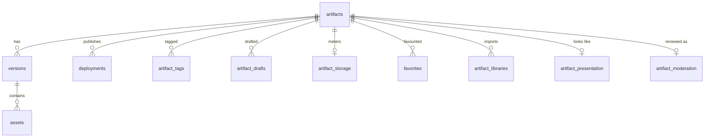

`artifacts` was 42 columns; it is 22 now, in three groups:

- **Identity** — `name`, `slug`, `display_slug`, `description`, `type_metadata`, and
  `artifact_type`: `html`, `csv`, `txt`, `markdown`, `json`, `pdf`, `image`, `video`,
  `skill`, `library` (`ArtifactType` in `src/types.ts`)
- **Ownership** — `owner_id`, `workspace_id` (nullable = personal), `folder_id`,
  `is_example`, `paused`, `deleted_at` (soft delete)
- **Access** — `visibility` (`private`, `public`, `workspace`), `auth_method`,
  `password_hash`, `access_policy`, the four `allow_anon_*` flags

Access stays on the spine deliberately: `visibility` is filtered in the list WHERE
clause and pairs with `owner_id`/`workspace_id` in two composite indexes, neither of
which a satellite table could carry.

The other 16 columns moved to two 1:1 satellites. **Both are optional — no row means
every column is at its default**, so every read is a `LEFT JOIN` with `COALESCE`
(`COALESCE(m.status, 'approved')`, `COALESCE(p.embed_allowed, 1)`, …). An `INNER JOIN`
here would silently drop artifacts from listings.

| Table | Holds |
|---|---|
| `artifacts` | See above. Soft-deleted via `deleted_at`; nearly every listing query filters `deleted_at IS NULL`. |
| `artifact_presentation` | How the artifact looks when linked, embedded or installed: `social_*` for link previews, `thumbnail_*`, `pwa_config`, `has_mobile`, `embed_allowed`/`embed_origins`, `editor_readiness`, `auto_summary_hash`. Written through `setPresentation()`. |
| `artifact_moderation` | Review state: `status`, `reason`, `checked_at`, `content_hash`, and `held_visibility` (the visibility to restore once a hold lifts). Most artifacts never get a row. Written through `setModeration()`. |
| `versions` | Immutable snapshots. `version_no` increments per artifact; `manifest_json` describes the bundle; `entrypoint`/`mobile_entrypoint` name the HTML root. |
| `deployments` | Points a `channel` at a `version_id` under a `slug` — `production` is what visitors resolve to, `candidate` stages the next one. This is the table serving reads. |
| `assets` | Files inside a version: `path`, `r2_key`, `mime`, `size_bytes`, `sha256`. |
| `artifact_tags` | Freeform labels. |
| `artifact_drafts` | Unsaved editor work, per artifact and user. |
| `artifact_storage` | Per-artifact rollup of `used_bytes`/`blob_count` for quota checks. |
| `artifact_libraries` | Which library artifacts an artifact imports, pinned to a `semver`. |
| `library_versions` | Published version rows for an artifact acting as a library. |
| `artifact_perf` | Real-user Core Web Vitals samples (`fcp`, `lcp`, `dcl`, `ttfb`). |
| `artifact_agent_config` | Per-artifact agent setup: separate `visitor_*` and `admin_*` model/prompt/context settings, plus `pilot_enabled`. |
| `favorites` | User-starred artifacts. |
| `user_recent_views` | Most-recent-view index powering "jump back in". |
| `share_links` | Tokenised links to a presentation or artifact, gated by `gate`/`gate_value`, with `expires_at`, `max_views`, `revoked`. |

## 04 Data connections

Artifacts are not static pages — they query live data. This domain holds the sources, the
cached results, and the secrets used to reach them.

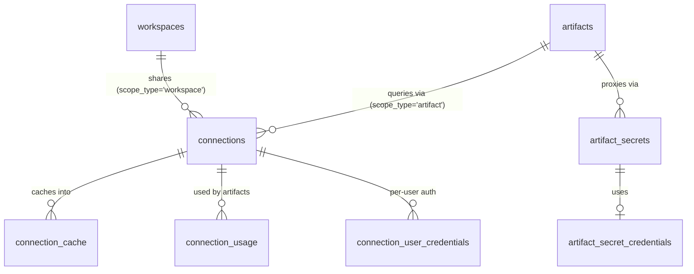

One table, two scopes: `scope_type` is `artifact` (this artifact's own connector) or
`workspace` (shared across the tenant), and resolution by name tries artifact-local
first. `kind` splits queryable data sources (`generic`) from OAuth app connections
(`platform`).

| Table | Holds |
|---|---|
| `connections` | Every outside system this instance reaches, at either scope. `provider` + JSON `config` say what it is, `encrypted_credentials`/`iv` hold one credential blob, and `cache_ttl_seconds`/`rate_limit_rpm` bound its use. Workspace rows add `is_private` (hide from other members), `credential_scope` (shared vs per-user auth) and `agent_query_enabled`. Sheets and GitHub OAuth grants are rows here too. |
| `connection_cache` | Query results cached to R2, keyed by `query_hash`, expiring via `expires_at`. |
| `datasets` | Uploaded static datasets (`format`, `r2_key`, `sha256`, `version`). |
| `connection_user_credentials` | One member's own credentials, when `credential_scope` is `per_user`. |
| `connection_usage` | Which artifacts have reached through a connection, and how often. |
| `workspace_shared_tables` | Exposes one artifact's table to the workspace under `shared_name` with an `access` level. |
| `sheet_syncs` | Sheet binding: spreadsheet, sheet, target table, sync direction and schedule. Holds no credentials — the artifact's Sheets row in `connections` does. |
| `sheets_sync_log` | Per-sync outcome: direction, status, rows affected, error. |
| `artifact_secrets` | Secret-proxy rule: which `allowed_hosts`/`allowed_methods`/`allowed_paths` a browser call may reach, and how the credential is injected. |
| `artifact_secret_credentials` | The encrypted credential a proxy rule injects. |
| `secret_audit_log` | Every proxied call: method, host, path, status, duration. |
| `artifact_proxy_config` | Per-artifact proxy allow/block lists, cache TTL, rate limit. |

## 05 Comments & editor

Review threads on published artifacts, and the collaborative editing session state.

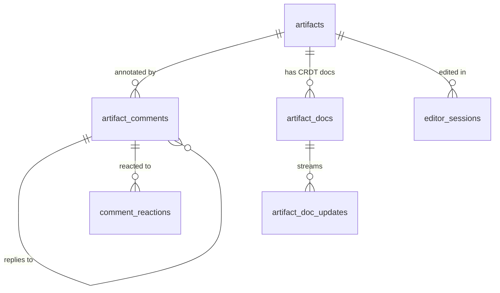

| Table | Holds |
|---|---|
| `artifact_comments` | Threaded via self-referencing `parent_id`. `position` anchors a comment to a spot in the page; `context_id` scopes it to a sub-view. Doubles as a task: `assignee_user_id`/`assignee_email`/`due_at`. `author_type` distinguishes human, agent, and anonymous authors. |
| `comment_reactions` | Emoji reactions. |
| `comment_reads` | Per-user `last_read_at` for unread badges. |
| `artifact_docs` | CRDT documents for real-time collaboration. `snapshot`/`snapshot_sv` are Yjs binary blobs. |
| `artifact_doc_updates` | Incremental CRDT updates in `seq` order, compacted into snapshots. |
| `artifact_pending_edits` | Agent-proposed edits awaiting accept/reject, holding both original and new content. |
| `editor_sessions` | Live presence: cursor position, selection, colour, `last_active`. |
| `editor_pending_changes` | Editor changes queued for review, tied to a chat context. |

## 06 Slides & presentations

A presentation mode built on artifacts, including live presenter control and per-slide
viewing telemetry.

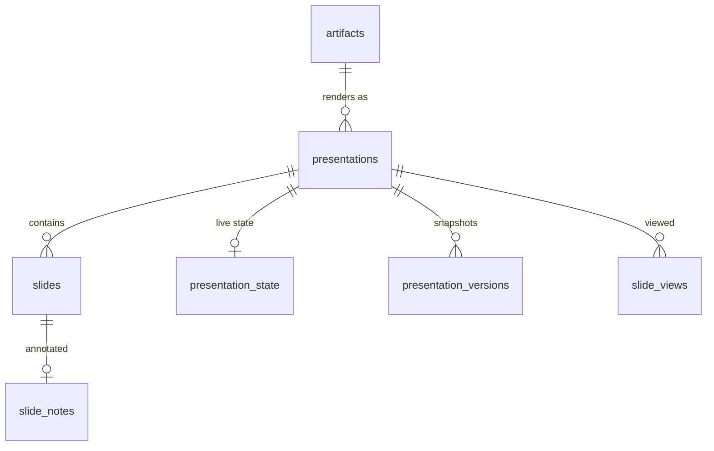

| Table | Holds |
|---|---|
| `presentations` | Deck settings: dimensions, `aspect_ratio`, default fonts/colours/transition, `template`, `visibility`. |
| `slides` | One slide: `position`, `content`, per-slide overrides, `hidden`, `locked`. |
| `slide_notes` | Speaker notes. |
| `presentation_state` | Live presenter session — the one genuinely mutable row per deck: who is presenting, current slide, countdown timer, laser-pointer coordinates. |
| `presentation_versions` | Named or auto-saved deck snapshots. |
| `slide_views` | Per-slide dwell time within a viewing session. |

## 07 Agents, crews & skills

Two generations of agent support. **Agent chat** (`agent_*`) is the per-artifact assistant.
**Crews** (`crew_*`) are the autonomous runtime with budgets, tool grants and approvals.
**Skills** are reusable instruction bundles, themselves stored as artifacts.

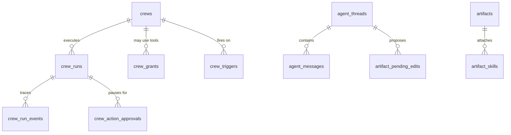

| Table | Holds |
|---|---|
| `agent_threads` | Every AI conversation in the product, on whichever surface: `scope_type` is `artifact_visitor`, `artifact_admin`, `workspace` or `editor`, and `scope_key` is the artifact or workspace it belongs to. `user_id` is NULL only for anonymous visitors, who are keyed by `session_id`. Token totals are kept by the artifact surfaces. |
| `agent_messages` | Turns, with `suggested_edits` and `applied_at` when a turn proposed a change. |
| `agent_usage` | Aggregated per-artifact, per-period agent usage. |
| `agent_usage_events` | Per-call cost ledger: provider, model, tokens, `base_cost_micro_usd` vs `billed_cost_micro_usd`, `byo` flag. |
| `crews` | An autonomous agent: `instructions`, `model`, and hard limits (`max_iterations`, `run_budget_micro_usd`, `max_runtime_ms`). |
| `crew_runs` | One execution: `status`, `termination_reason`, iterations, tokens, cost. |
| `crew_run_events` | Ordered trace of a run — tool calls, inputs, outputs, latency. The debugging surface. |
| `crew_triggers` | What starts a crew: `cron` or an event, with an optional `condition_json`. |
| `crew_grants` | Which tools a crew may call, in what `mode`, under what `approval_policy`. |
| `crew_action_approvals` | A paused tool call waiting on a human decision. |
| `plan_crew_limits` | Per-tier quota ceilings. Optional — falls back to constants in `src/crew/limits.ts`. |
| `skill_marketplace` | Published skill listing: counters, `score`, `featured`, `official`, `blocked`. |
| `skill_installs` / `skill_votes` / `skill_uses` | Install, upvote and usage records feeding the score. |
| `artifact_skills` | Skills attached to an artifact, pinned to `skill_version_no`. |
| `workspace_agent_skills` | Skills attached at workspace level. |

## 08 Scheduled jobs

Cron- and event-triggered work: deliver an artifact by email, hit a webhook, refresh a
snapshot, run tests.

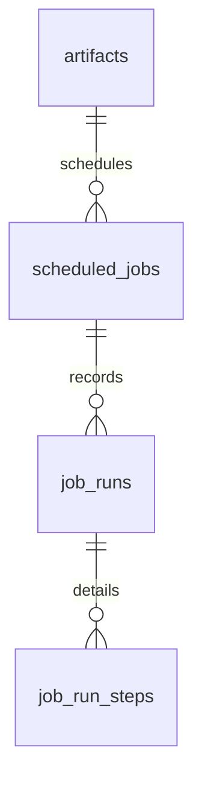

| Table | Holds |
|---|---|
| `scheduled_jobs` | The job. `action` picks a destination in `src/delivery/`; `trigger_type` is `cron` or `event`; `config` is action-specific JSON. Retry policy lives in `max_attempts`/`backoff_type`/`initial_delay`. `next_run_at` is the scheduler's work queue. |
| `job_runs` | One row per execution: status, duration, error, response. `created_at` holds **unix seconds** as TEXT here, not ISO — the scheduler writes and compares it that way. |
| `job_run_steps` | Per-step breakdown within an execution, for the run inspector. |
| `webhook_log` | Inbound webhook deliveries (billing provider callbacks), with outcome and status code. |

> The four enum columns here (`action`, `trigger_type`, `backoff_type`, `event_type`) were
> once enforced by database triggers. Migration `0135` removed them — validation now lives in
> `src/scheduling/jobs/types.ts`. See [CONVENTIONS.md](CONVENTIONS.md#constraints-belong-in-the-application).

## 09 Analytics & audit

View tracking and its rollups, plus operational logging. Visitor identity is hashed
(`visitor_hash`, `ip_hash`), never stored raw.

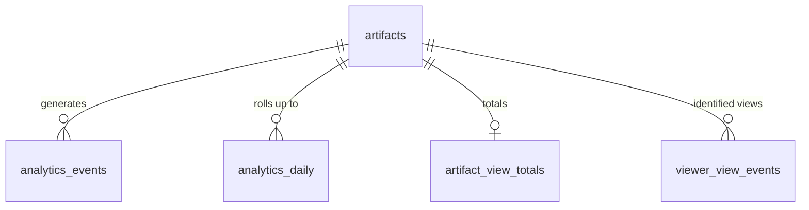

| Table | Holds |
|---|---|
| `analytics_events` | Raw view events: type, hashed visitor, referrer, country, path. |
| `analytics_daily` | Per-artifact daily rollup with top referrers/countries/paths as JSON. |
| `analytics_agg_state` / `analytics_agg_cursor` | Bookkeeping for the incremental aggregation job — which day is done, and where the last pass stopped. |
| `artifact_view_totals` | Denormalised lifetime totals, kept current so listings need no aggregate query. |
| `view_sessions` | A viewing session for a presentation or artifact: duration, slides seen, completion. |
| `viewer_view_events` | Views attributed to a known `email` (shared-with-a-person tracking), as opposed to anonymous. |
| `funnel_events` | Product funnel instrumentation keyed by session id. |
| `health_metrics_hourly` | Hourly request counts by status class, plus duration sum/max and latency buckets. |
| `ops_error_log` | Sampled request errors with route, status, and `request_id`. |
| `audit_log` | Security-relevant workspace actions: actor, action, target, detail. |

## 10 Metrics, alerts & watches

User-defined metrics over artifact data, and the alerting built on them. Two mechanisms:
explicit `metric_alert_rules` (user authors a condition) and `metric_watches` (automatic
drift detection on a column).

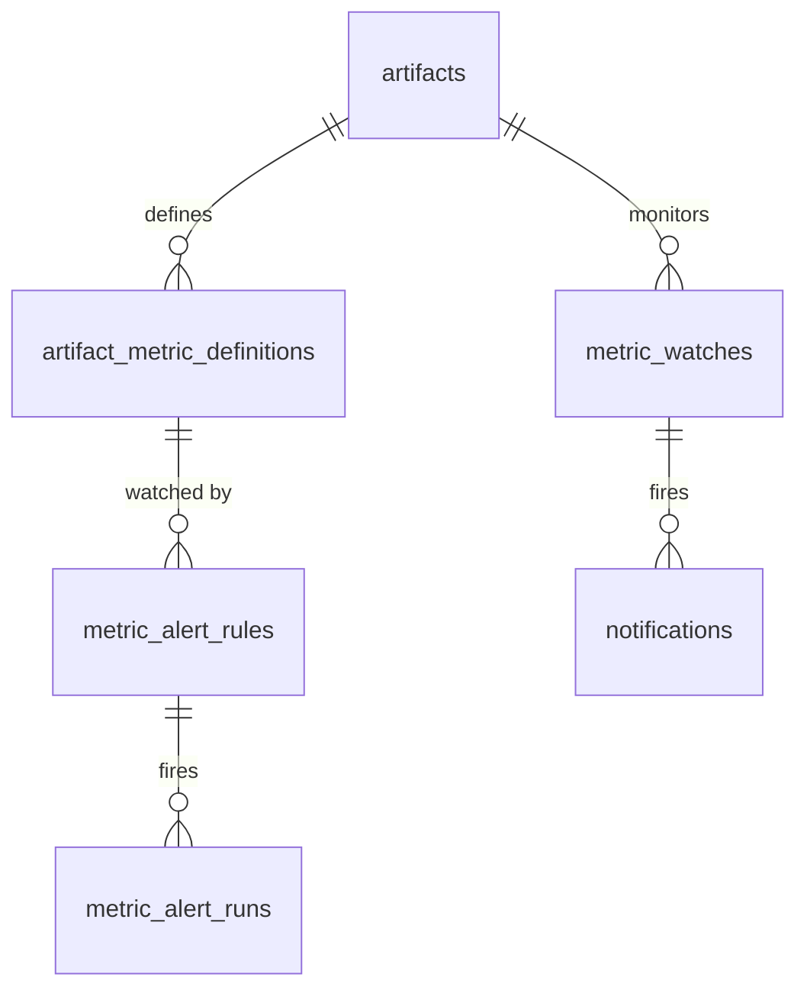

| Table | Holds |
|---|---|
| `artifact_metric_definitions` | A named metric over an artifact's data: `source_json` says how to compute it, `format` how to display it. |
| `metric_alert_rules` | Condition + schedule + destination, with the whole last-evaluation state inline (`last_value`, `last_status`, `last_triggered_at`, `cooldown_seconds`). `next_run_at` is the scheduler queue. |
| `metric_alert_runs` | Each evaluation: value, whether it matched, whether delivery succeeded. Written on *every* evaluation, matched or not — an evaluation ledger, not a notification. |
| `metric_watches` | Automatic threshold watch on a table column (`threshold_pct` drift). |
| `notifications` | Every "the system needs to tell someone something" row, whatever raised it: a watch firing, a connection going stale, the janitor finding unopened pages, a moderation decision. `recipient_type` is `user`, `workspace`, or `artifact` (meaning whoever can already see that artifact); `subject_*` points at what it is about; `payload` holds the kind-specific extras. **Not** a delivery log — `metric_alert_runs` is the evaluation ledger, and dismissals live in `home_event_dismissals` because they cover every feed row, not just these. |

## 11 Email & messaging

Artifacts have real inboxes, and users get notified through email or a chat platform.

| Table | Holds |
|---|---|
| `artifact_emails` | An artifact's email identity (`email_prefix`) and inbound settings: `inbound_enabled`, `inbound_allowlist`, plus daily send/receive counters that reset on `last_reset_date`. |
| `email_templates` | Reusable subject/HTML/text with a `variables_schema`. `is_system` marks built-ins. |
| `email_log` | Deduplication ledger — `(type, key)` records that a given email was already sent. |
| `email_preferences` | Per-user, per-category opt-in. |
| `email_suppressions` | Hard suppression list from bounces, complaints and unsubscribes. |
| `messaging_links` | Chat-platform DM ↔ user binding with a selected workspace, keyed by (`platform`, `session_key`). Telegram uses the chat id as the session key; Slack uses `{team_id}:{user_id}`. |

## 12 AI usage metering

**There is no billing in ShareOut.** The open-source build is free and stays free. The
subscription tables that used to sit here — `subscriptions`, `subscription_plans`,
`subscription_payments`, `invoice_sequence`, `billing_webhook_events` — lost their last
readers when the paywalls were removed (#40, #44) and are no longer created. Same for
`ai_credit_topups` and `workspace_ai_credit_snapshots`, which belonged to a prepaid-credit
flow that never shipped.

What remains is **usage metering**, which matters whether or not anyone is billed: knowing
what a workspace spends on model calls is how you set a budget and notice a runaway agent.

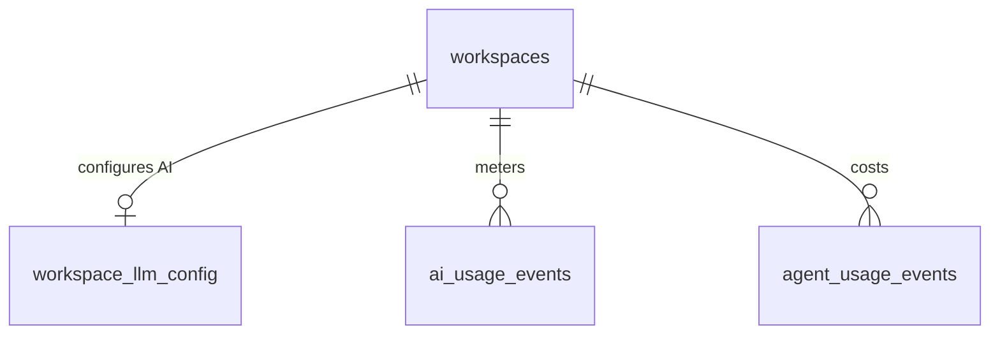

| Table | Holds |
|---|---|
| `ai_usage_events` | Metered AI usage: `kind`, `model`, `units`, `unit_kind`, `base_cost_micro_usd`, `source`. |
| `agent_usage_events` | Per-call cost ledger for agent and crew work — documented under [07 Agents](#07-agents-crews--skills). |
| `workspace_llm_config` | Provider credentials, balance, markup and monthly budget — documented under [02 Workspaces](#02-workspaces--access-control), where it sits in the baseline. |

Cost is stored in **`_micro_usd`** — millionths of a dollar, as `INTEGER`. Per-token amounts
round to zero in cents, and `REAL` money is a bug waiting to happen.

Crew spend ceilings live in `plan_crew_limits` ([07 Agents](#07-agents-crews--skills)). It is
keyed by `users.tier`, which still exists as an account label even with no billing attached —
a self-hoster can set a tier by hand to give some accounts bigger budgets. See
[`seeds/crew-limits.example.sql`](../seeds/crew-limits.example.sql).

> Money uses two units deliberately: **`_cents`** for real currency charged to a card, and
> **`_micro_usd`** (millionths of a dollar) for AI costs, where per-token amounts round to
> zero in cents. Both are `INTEGER`, never `REAL`.

## 13 Assets, blobs & knowledge

Uploaded files, from raw storage through curated client-facing collections, plus the
workspace knowledge index.

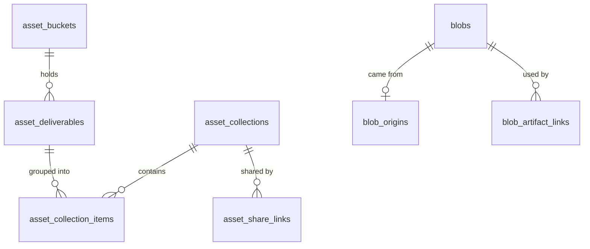

| Table | Holds |
|---|---|
| `blobs` | An uploaded file: `r2_key`, mime, size, optional `deliverable_id` and `version_no`. |
| `blob_origins` | Provenance when a blob arrived by email — sender, subject, body, message id. |
| `blob_artifact_links` | Which artifacts reference a blob. |
| `upload_tokens` | Short-lived, single-use authorisations to write one `r2_key`, for both upload paths — `kind='dataset'` names the dataset and format, `kind='blob'` the filename, mime type and size ceiling. |
| `asset_buckets` | An artifact acting as a file bucket for a workspace or user. |
| `asset_deliverables` | A named, versioned file deliverable with its own `visibility` and soft delete. |
| `asset_collections` / `asset_collection_items` | Ordered groupings of deliverables. |
| `asset_share_links` | Tokenised share of a collection, gated and revocable. |
| `file_artifact_usage` | Which artifacts consume which deliverable. |
| `catalog_settings` | Enable flag for the per-workspace data catalogue. The files themselves are `workspace_files` rows with `namespace='catalog'`. |
| `knowledge_ingest` | Queue of artifacts awaiting knowledge extraction, deduped by `content_hash`. |
| `knowledge_settings` | Per-workspace enable flag and `last_consolidated_at`. |
| `knowledge_tombstones` | Paths deliberately forgotten, so re-ingestion does not resurrect them. |

## 14 Moderation, support & tests

Keeping a public publishing platform safe, supporting its users, and letting artifacts test
themselves.

| Table | Holds |
|---|---|
| `abuse_reports` | Viewer-submitted reports, keyed by `reporter_ip` (no account required), with `category` and `status`. |
| `artifact_publish_approvals` | A request to publish publicly, pinned to a `content_hash` so approval cannot be reused after an edit. |
| `artifact_publish_approval_voters` | Individual approver decisions, counted against `approvals_required`. |
| `tickets` | Support ticket: channel, subject, status, priority, `sla_due`, plus AI-drafted reply fields. |
| `ticket_messages` | Ticket conversation. |
| `artifact_tests` | Per-artifact test config: `spec`, `mode`, `baseline_version_id`. |
| `artifact_test_runs` | One test execution: pass/fail/error counts and full `results`. |
| `platform_config` | Instance-wide key/value settings. |

---

## Cross-cutting patterns

**Encryption at rest.** Any column pair `*_encrypted` / `encrypted_credentials` + `iv` is
AES-GCM. The key comes from the Worker environment, never the database. This appears in
`connections`, `connection_user_credentials`, `artifact_secret_credentials`,
`google_oauth_tokens` and `workspace_llm_config`.

One row stores **one** blob under **one** `iv`: an AES-GCM iv authenticates exactly the
ciphertext it was generated for, so a credential with several parts (access token,
refresh token, expiry) is encrypted as a single JSON object, never as two columns
sharing an iv. The old Sheets and Google OAuth token rows did the latter, which made
every refresh token undecryptable.

**Hashed, never stored.** Anything named `*_hash` — `token_hash`, `code_hash`,
`password_hash`, `visitor_hash`, `ip_hash`, `content_hash` — is a one-way digest. Bearer
secrets are shown once at creation and are unrecoverable afterwards.

**R2 pointers.** `r2_key` means the bytes are in object storage. Deleting the row does not
delete the object; that is the janitor's job.

**Soft delete.** `artifacts` and `asset_deliverables` use `deleted_at IS NULL`. Everything
else deletes for real.

**Denormalised counters.** `artifact_view_totals`, `artifact_storage`, `skill_marketplace`
counters and `workspace_library` counters are maintained rollups, not query-time aggregates.
They can drift; treat the event tables as the source of truth.

**Scheduler queues.** `scheduled_jobs.next_run_at`, `metric_alert_rules.next_run_at` and
`crew_triggers.next_run_at` are all polled the same way: "give me rows where enabled and
`next_run_at <= now`".

**Timestamps are one type and one format, everywhere.** Every `*_at` column is `TEXT`
holding `YYYY-MM-DDTHH:MM:SS.sssZ` — byte-identical to JavaScript's
`new Date().toISOString()`, so comparing two of them is a string comparison and reading
one is `new Date(value)`. `*_date` columns are `YYYY-MM-DD`. See
[CONVENTIONS.md § Timestamps](CONVENTIONS.md#timestamps-one-type-one-format-one-vocabulary)
for why the SQL default is the verbose `strftime` form and not `datetime('now')`.

## What the schema guarantees

Documented because a schema that hides its rough edges wastes the reader's time — and
because these three used to be the rough edges.

**Every reference is enforced.** `artifact_id`, `workspace_id`, `user_id` and `owner_id`
declare a foreign key in every table that has them. Ownership cascades. Attribution
(`created_by`, `invited_by`, `decided_by`) deliberately does not — deleting a user must
not delete the audit trail. Three rows outlive their parent on purpose and use
`ON DELETE SET NULL`: `audit_log.workspace_id`, and `ai_usage_events.workspace_id` /
`.user_id`. A fresh apply passes `PRAGMA foreign_key_check`.

**Every table records when its row happened** — `created_at`, or a domain moment that
says it better (`linked_at`, `dismissed_at`, `viewed_at`, `window_start`, `period`,
`date`). `scripts/check-migrations.mjs` fails the build on a table with neither.

**Every table is documented here and read by code.** The checker fails on a table that
never reaches this file; the last unreachable tables (seven billing, a quiet-hours stub,
a per-slide timing table) were deleted in PR-1.

**One timestamp exception, on purpose.** The scheduler cursors — `next_run_at`,
`last_run_at`, `job_runs.created_at` — hold unix seconds as TEXT. They are queue keys the
dispatch loop compares and advances numerically, and `crew_triggers` compare-and-swaps on
the exact stored value. See
[CONVENTIONS.md § Timestamps](CONVENTIONS.md#timestamps-one-type-one-format-one-vocabulary).

**One overlap remains, and it is a real distinction, not a leftover**: `agent_threads`
is a conversation with a human in the loop; `crew_runs` is an autonomous execution with a
budget and a termination reason. They looked like duplicates from the table names alone —
reading them side by side is what showed they are not.
